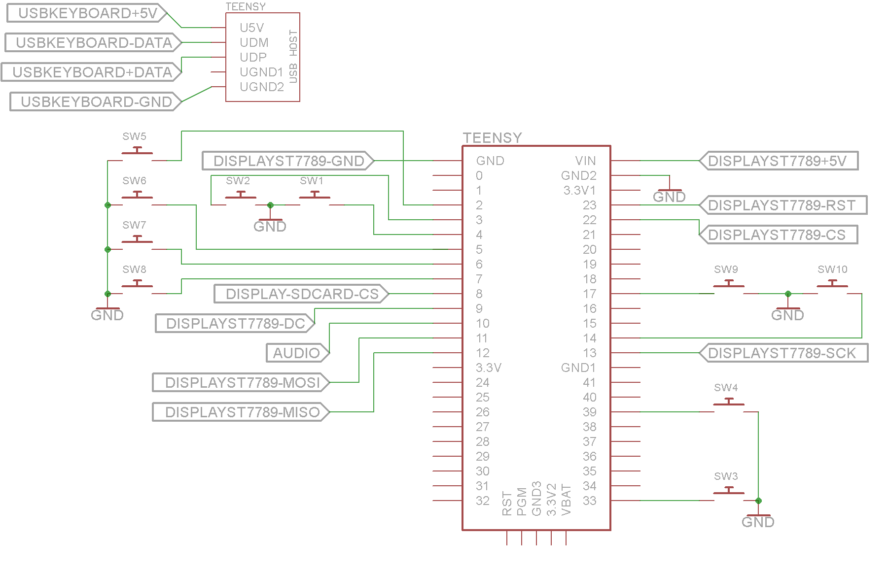
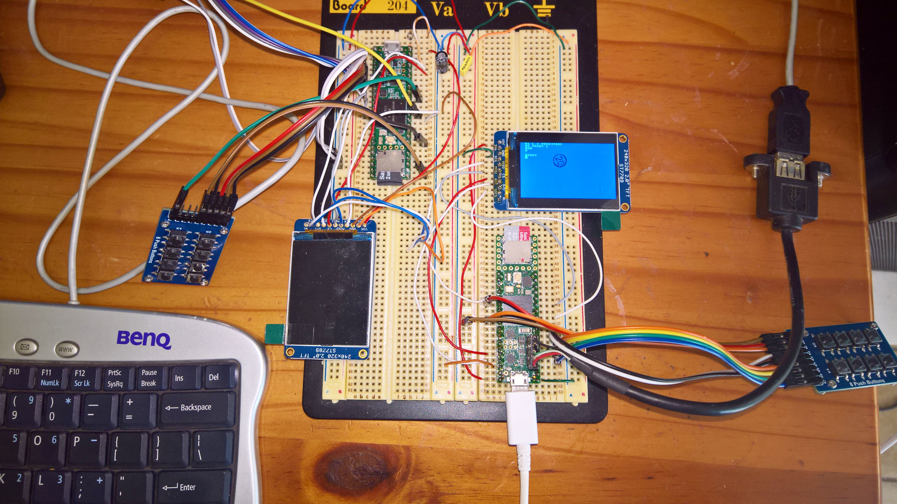
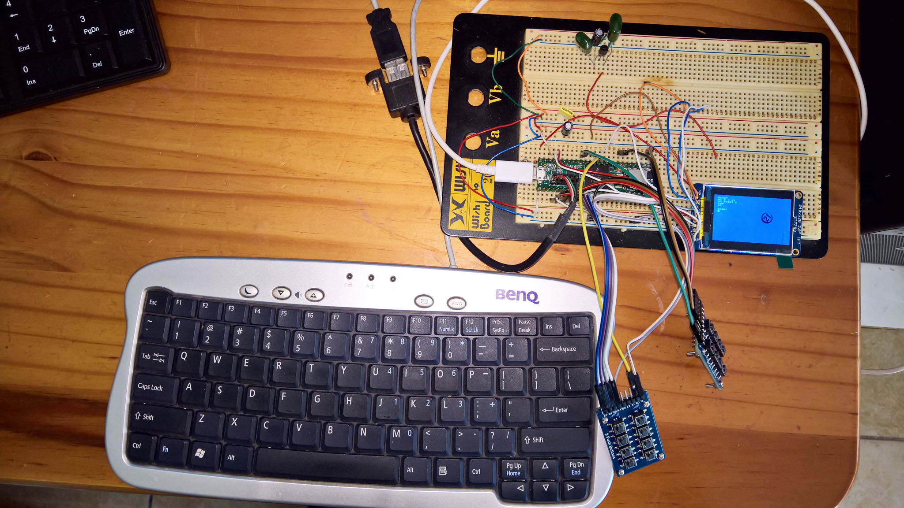
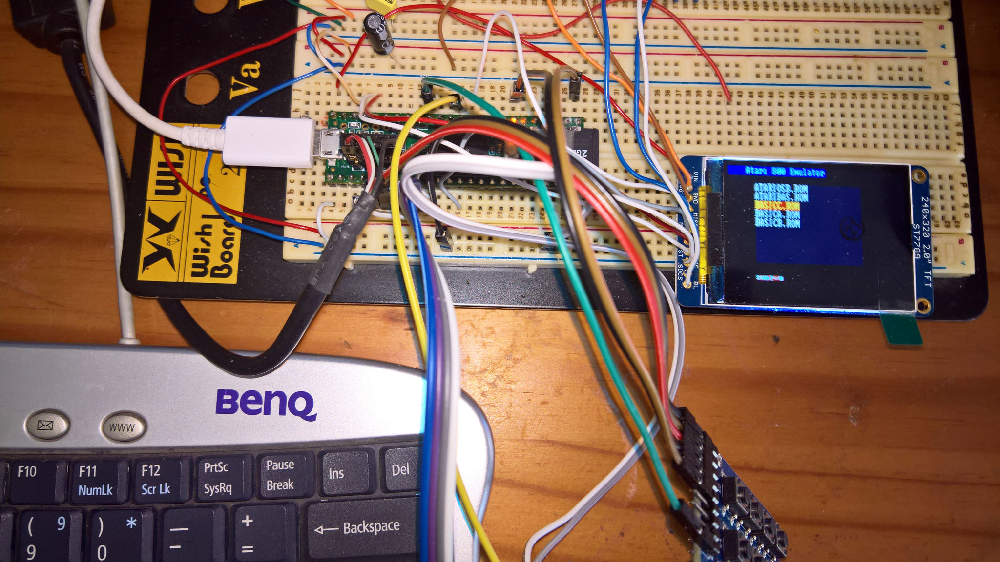
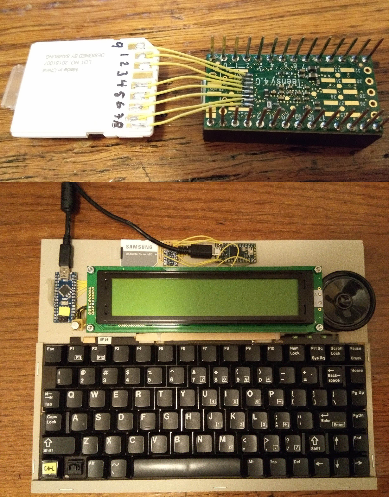

# USB Keyboard modification of M.CU.M.E = Multi CompUter Machine Emulator  

All credit to https://github.com/Jean-MarcHarvengt/MCUME for the emulation software and https://www.pjrc.com/teensy/ for the hardware and libraries.

For the fidelity of this simulation refer to the two larger photos at the end of the description of the repository Atari600XL-Upgrades https://github.com/TobiasVanDyk/Atari600XL-Upgrades, which shows a comparison of the real versus simulated Atari Graphics Mode 0

  
 

I am currently experimenting with adding a standard usb keyboard to a Teensy 4.0 (first and second photos), Teensy 4.1 (third photo), and a Teensy 3.6 (fourth and fifth photos), using their onboard USB hubs. The Teensy 4.0 used the two bottom USB hub pins D- and D+, as well as an external SDCard adapter. My only interest currently is in modifying and developing the Atari 800/800XL emulations, in part because these are the only working original 1980's hardware (and original OSROMS), I have - also see https://github.com/TobiasVanDyk/Atari600XL-Upgrades.

The code (as inside the TeensyAtari folder), is functional for the Teensy 4.1, Teensy 4.0 and 3.6 (and tested running Atari Basic plus a number of games), but is still experimental. The display is an Adafruit ST7789 240x320 IPS display (https://learn.adafruit.com/2-0-inch-320-x-240-color-ips-tft-display).

For the Teensy 4.0 the SDcard adapter on the display was used, and SDCS was connected to pin 8 (Teensy 4.0) and MISO to pin 12 (Teensy 4.0). This is the configuration used in the TeensyAtari folder. To use the Teensy 4.1 and Teensy 3.6 onboard SDCard select the required option in platform_config.h (comment out 
EXTERNAL_SD).

### Schematic 
If the built-in SDCard of the Teensy 4.1 or 3.6 is used the the connections to pin 8 and pin 12 are not required. None of the joystick switches are essential as the ROM selection can be done using the usbkeyboard. For all three Teensy's the schematic is then as below, with all possible input and output devices:
 

  
 
  
### Testing (Teensy 4.0):
 

  
 

 

  
 
  
### Testing (Teensy 4.1):
 

  
 
  
### Testing (Teensy 3.6):
 

  
 

 

  
 

### Adafruit ST7789 240x320 IPS display 
From https://learn.adafruit.com/2-0-inch-320-x-240-color-ips-tft-display:
 

  
 

### An alternative solution for the Teensy 4.0 SDCard: 
From https://hackaday.io/project/171471-pz1-6502-laptop:
 

  
 
