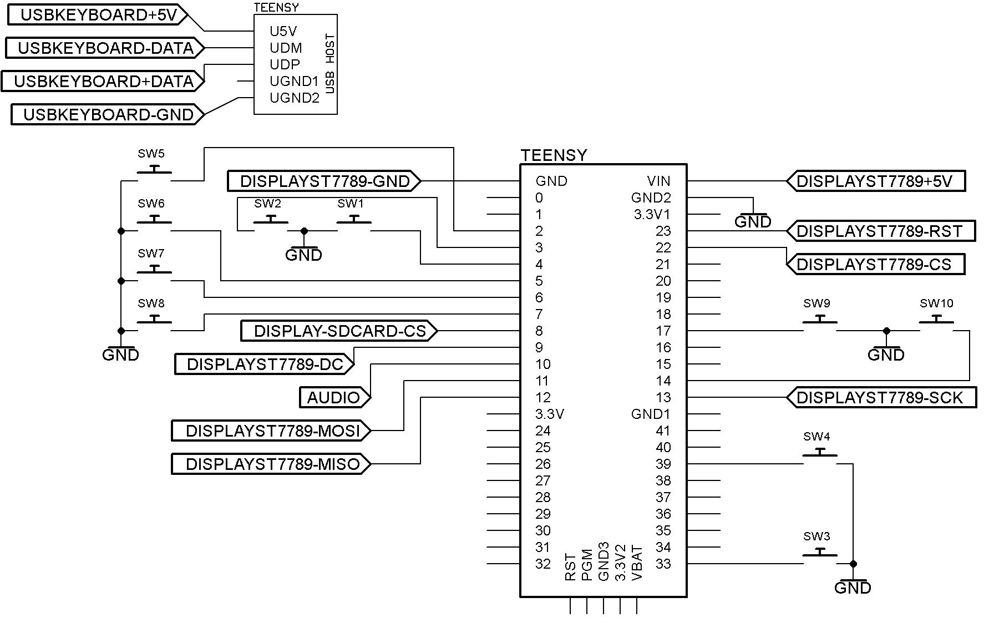

# USB Keyboard modification of M.CU.M.E = Multi CompUter Machine Emulator  

All credit to [**MCUME**](https://github.com/Jean-MarcHarvengt/MCUME) for the emulation software and [**PJRC**](https://www.pjrc.com/teensy/) for the hardware and libraries.

For the fidelity of this simulation refer to the photo below, which compares an upgraded 600XL with the simulated Atari Graphics Mode 0 as presented here.

  
 

A standard usb keyboard has been added, as the main input device to the MCUME emulator, for a

* **Teensy 4.0 with a external SDCard** (first and second photos below), 
* **Teensy 4.1 using either its built-in SDCard (third photo), or an external SDCard**, and a 
* **Teensy 3.6 using its built-in SDCard** (fourth and fifth photos), 

where the USB keyboard is attached to their onboard USB hubs. The Teensy 4.0 used the two bottom USB hub pins D- and D+, and +5v for Vusb, for the usb hub. The intention is to further modify and develop the Atari 800/800XL emulation codebase, in part because these are the only working original 1980's hardware (and original OS-ROMs), I have - also see [**Atari600XL-Upgrades**](https://github.com/TobiasVanDyk/Atari600XL-Upgrades). An obvious example for this would be to add support for a usb game controller or a usb joystick.

For a much cleaner usb keyboard implementation (but for a C64 emulator), refer to [**FrankB**](https://github.com/FrankBoesing/Teensy64) [**link 1**](https://github.com/FrankBoesing/Teensy64/blob/master/Teensy64/keyboard_usb.cpp) and [**link 2**](https://github.com/FrankBoesing/Teensy64/blob/master/Teensy64/keyboard_usb.h).

The code (as inside the Teensy40Atari and Teensy41Atari folders), is fully functional - including working sound - for the Teensy 4.0, 4.1, and 3.6. For the Teensy 4.0 use the standard Arduino SD library when compiling. If the Teensy SD library is used for the Teensy 4.0 with an external SDCard, the sound will not function. All were tested running Atari Basic plus a number of games. The display is an [**Adafruit ST7789 240x320 IPS display**](https://learn.adafruit.com/2-0-inch-320-x-240-color-ips-tft-display), which also has an SDCard holder, used for the Teensy 4.0.

As mentioned, for the Teensy 4.0 the SDcard adapter on the display was used, and SDCS was connected to pin 8 (Teensy 4.0) and MISO to pin 12 (Teensy 4.0). This is the configuration as used in the Teensy40Atari folder. To use the Teensy 4.1 and Teensy 3.6 onboard SDCard select the required option in platform_config.h (comment out 
EXTERNAL_SD), which is the configuration used in the Teensy41Atari folder.

### Schematic 
If the built-in SDCard of the Teensy 4.1 or 3.6 is used the the connections to pin 8 and pin 12 are not required. None of the joystick switches are essential as the ROM selection can be done using the usbkeyboard. For all three Teensy nodels the schematic is as below - except (1) Teensy 3.6 has two DAC-based Audio outputs - refer to pinout2.txt, (2) Teensy 4.0 Pin 8 connected to Display SDCard CS, and (3) Teensy 4.0 footprint stops at pin 12 in the schematics, and continues with pin 13 on the other side. All possible input and output devices are shown except those mentioned in the previous sentence, and except the analog joystick:
 

  
 
  
### Testing (Teensy 4.0):
 

  
  
 
  
### Testing (Teensy 4.1):
 

 
   
 
  
### Testing (Teensy 3.6):
 

  
  
 

### Adafruit ST7789 240x320 IPS display 
From [**Adafruit**](https://learn.adafruit.com/2-0-inch-320-x-240-color-ips-tft-display):
 

  
 

### An alternative solution for the Teensy 4.0 SDCard: 
From [**PZ1-6502-Laptop**](https://hackaday.io/project/171471-pz1-6502-laptop):
 

  
 

**To do 1**: *Add usb game controller or usb joystick as input device.*

